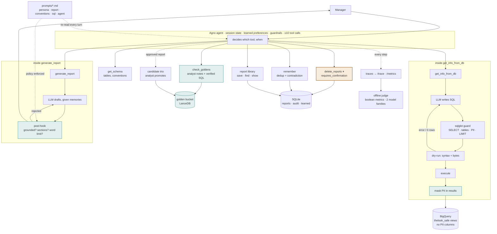

# TheLook Analyst Agent — High-Level Design and Technical Explanation

A chat assistant that lets store and regional managers ask questions about sales, customers and products in natural language, discuss the results, and produce reports with action items — over the `bigquery-public-data.thelook_ecommerce` dataset (`orders`, `order_items`, `products`, `users`).

| | |
|---|---|
| **Models** | One model for everything — `google/gemini-2.5-flash` via OpenRouter — with Gemini direct as the fallback. Judges: `gemini-2.5-flash` + `claude-haiku-4.5`, deliberately different families. All overridable in `.env`. |
| **Runtime** | Agno 3.0.1, Python 3.12 |
| **Interface** | CLI chat (`rich`); the same core runs behind an HTTP service in production |
| **Setup and example run** | see [`README.md`](../README.md) |

**Contents.** 1 Design summary · 2 Architecture · 3 Components and services · 4 Data flow · 5 How each requirement is handled · 6 Error handling and fallback · 7 Framework selection · 8 Alternatives considered · 9 Known limitations and evolution · 10 Sources

---

## 1. Design summary

**One agent. Every capability is a tool. The tools that need judgement make their own model call
inside themselves.** The agent decides *what* to do; each tool decides *how*. Failed SQL, rejected
report drafts and error text stay inside the tool that produced them and never enter the agent's
context, so its reasoning is not polluted by its own retries.

What is deliberately **not** left to the model: which tables the credential can reach, whether a
deletion executes, and whether a figure may appear in an answer. Those are enforced in code.

```
user message
   │
   └─► agent  (session state · learned preferences · input guardrails · ≤10 tool calls)
         ├─ check_goldens ......... what human analysts already worked out for this question;
         │                          a strong match returns an id that can be replayed verbatim
         ├─ get_info_from_db ...... LLM writes SQL → guard → dry-run → execute → PII mask → rows. On failure it is called again WITH
         │                          the error text attached, so it cannot repeat the same mistake
         ├─ generate_report ....... LLM drafts → post-hook: is every figure in the data? are the
         │                          required sections there? is it within the persona's word limit?
         │                          Rejected → one retry naming the problem
         ├─ save_report ........... + a generated description + queued as a golden candidate
         ├─ get_reports / show .... searchable by description
         ├─ delete_reports ⏸ ...... pauses for a typed DELETE, with a preview of exactly what goes
         └─ remember .............. dedups and resolves contradictions before writing
```

**The report is a conversation, not an output.** The manager can reject it; the agent asks what was
wrong, then regenerates addressing that specifically — and if the complaint was about the *data*, it
re-queries first. Approval is the moment three things happen at once: the report is saved, what was
learned about this manager is recorded, and the analysis is queued as a candidate for the verified
library.

### Why one agent rather than a hand-orchestrated pipeline

Splitting the work into separate intent-classification, planning, SQL-repair and report-writing stages
costs three model calls where one loop suffices, turns follow-up questions into a rewriting problem
instead of a conversation, and puts every failed query into the agent's history. A single agent with
tools avoids all three. The two properties that genuinely cannot be left to a model — the guarded SQL
surface and the confirmation gate — stay outside the framework, in code.

### Why the golden lookup is a tool, not a router

Running a similarity search on *every* message to decide a route embeds messages like "save that as a
report" and "I like it" — a paid request each time, matched against analyst trios that no phrasing of
those messages should ever reach. Only the agent knows whether a message is analytical, so it calls
`check_goldens` itself. The cost is that it might skip the call; that is mitigated by making it
mandatory in the instructions and by a metric that counts analytical turns where it was skipped, so
the failure is visible rather than silent.

## 2. Architecture

The agent chooses tools; the tools do the work. Two of them run a model of their own, shown here as
the boxed subgraphs — the retry arrows inside those boxes never reach the agent's context. The
shaded path is the one that can destroy something, and it stops at a typed confirmation.



---

## 3. Components and services

| Block | Prototype | Production | Reasoning |
|---|---|---|---|
| **Agent runtime** | Agno 3.0.1 (pinned), Python 3.12, CLI via `rich`. **One** agent with tools, a bounded loop, session state and conversation history. | Agno AgentOS on Cloud Run; Google ADK on Vertex Agent Engine is the Google-native alternative | Chosen after a source-level audit of six frameworks (§7). What is actually used: `requires_confirmation` with persisted resume, the PII and prompt-injection guardrail classes, `session_state`, `add_history_to_context`, `tool_call_limit`, `fallback_models`. The guarded SQL surface, the report library and the learned-state store are plain Python, so a port to LangGraph touches one module. |
| **Language models** | Agent and tools both run `google/gemini-2.5-flash` through **OpenRouter**, with Gemini direct behind it as the fallback. The agent reaches it through Agno; the in-tool calls go through `analyst/llm.py`. Judges use two families. | Same via Vertex AI (`vertexai=True`) with Application Default Credentials / Workload Identity — no API keys in production | Measured against a fresh AI Studio key: `gemini-3.6-flash` answers in 1.8 s but its free tier is **20 requests per day** (`GenerateRequestsPerDayPerProjectPerModel-FreeTier`), which rules it out as a primary; 3.5 Flash ≈ 9 s, 3.5 Flash-Lite ≈ 2 s, 3.1 Flash-Lite < 1 s, each with a separate quota; 3.7 Flash returned 503; 2.5 Flash is retired for new keys (404). A second provider is not decoration: each has its own quota, so the fallback is real capacity rather than a retry into the same exhausted bucket. Both providers are native Agno model classes. |
| **BigQuery access** | The `get_info_from_db` tool: generate → `sqlglot` guard (SELECT-only, allow-listed tables, PII deny-list, forced LIMIT, rewrite to safe views) → `dry_run` (syntax errors and byte estimate, free) → `maximum_bytes_billed` → execute → **mask the rows** | Same, over authorized views | Agno's built-in `GoogleBigQueryTools` executes any statement with no read-only, dry-run or LIMIT logic (verified in source) and is not used. |
| **Warehouse** | Public dataset through `users_safe` and pass-through views in the project's own dataset | Authorized views, column-level policy tags, row-level security | PII is absent by construction, not filtered after the fact. |
| **Golden bucket** | Trios as YAML, embedded with `gemini-embedding-001` (question + aliases, never the SQL) into LanceDB, reached through the `check_goldens` tool; approving a report queues it as a candidate, `/candidates` → `/promote` requires a human | Trio documents in GCS; embeddings in Vertex AI Vector Search or pgvector; Pub/Sub carries candidate events to the review queue | Trios are documents with a lifecycle — candidate → verified → stale — not rows. The queue is ~60 lines of plain code so the review step stays visible and testable; Agno's `LearnedKnowledge(mode=PROPOSE)` is the framework-native equivalent for production. **LanceDB** because the bucket is small (tens to hundreds of trios) and the store must run on any machine with no server: it is an embedded, single-directory store (`pip install`, no daemon — SQLite's role for vectors), it offers **hybrid** vector + keyword search, which matters for short questions that name a metric ("AOV", "return rate"), and Agno's `Knowledge` interface is the same for LanceDB, pgvector and Vertex, so the production swap is a constructor change. Chroma or sqlite-vec would also serve; LanceDB was preferred for hybrid search and Arrow-native results. |
| **Sessions, memory, run state** | Agno `SqliteDb` (`data/agno.db`): agent sessions, conversation history and paused runs. Own SQLite (`data/analyst.db`): turn log, per-user preferences, reports, audit, candidates | `FirestoreDb` for Agno state — same interface, constructor swap; Firestore collections for the rest | Small, per-user, transactional. Follow-up questions work because the agent carries its own session history (`add_history_to_context`), not because we rewrite the question. Preferences stay a typed table (`format`, `depth`, `charts`) — deterministic and inspectable, unlike free-text memory. |
| **Report library** | SQLite tables `reports`, `audit` (owner, session, title, body, `deleted_at`) | Firestore collection per user | Ownership is a `WHERE` clause; deletes are soft so the audit trail survives them. |
| **Persona and instructions** | `prompts/persona.md`, re-read on every turn | Firestore document with version history, edited through a small admin form | Non-developers change tone and instructions without a deployment. |
| **Traces** | JSONL per session plus a trace viewer command | OpenTelemetry → Langfuse (self-hosted, MIT) or Cloud Trace | Vendor-neutral spans with LLM-specific views for tokens and cost. |
| **Edge (production)** | — | Identity-Aware Proxy + Cloud Armor in front of Cloud Run | The manager's identity from the IAP header is the tenant key for memory and report ownership. |

---

## 4. Data flow

**Prototype — single process.** CLI → Agno agent → tools, all in-process. BigQuery is reached over the Google API with Application Default Credentials. Sessions, memory, paused run state and the report library share one SQLite file; the golden bucket is YAML in the repository indexed into LanceDB on disk; traces are appended to JSONL.

**Production.** CLI or web client → HTTPS behind IAP and Cloud Armor → Cloud Run running Agno AgentOS (REST). BigQuery via ADC / Workload Identity, no long-lived keys. Firestore for sessions, memory and reports. Golden bucket: trio documents in GCS, embeddings in Vertex AI Vector Search or pgvector; a Pub/Sub topic delivers candidate events to the review queue. Persona document in Firestore with versions. Spans over OTLP to Langfuse or Cloud Trace.

**What reaches the model on a slow-path turn.** The user's message; the persona instructions; the user's profile (preferred format, depth, charts); the schemas of the four **views**; the top-k retrieved trios (`question`, `analyst_notes`, `sql`) as few-shot context; the last N turns of the session. Raw PII columns never reach the model: they are absent both from the schema it is shown and from the views its credential can reach.

**What leaves the system.** Only the composed answer, after the output mask. Query results are consumed inside the tool; the model receives a bounded, formatted excerpt (row cap, LIMIT), never the full result set.

---

## 5. How each requirement is handled

### 5.1 Hybrid intelligence — the golden bucket

**Trio format.** Each trio is a document: `question`, `analyst_notes` (the interpretation — *revenue =
Σ `order_items.sale_price` excluding Cancelled and Returned; compare states per customer, not on raw
revenue*), `sql`, `report`, `tags`, `verified_at`, optional `parameters`. Following Pinterest's finding,
what gets embedded is the **question**, not the SQL.

**At query time.** `check_goldens` is a tool the agent calls, and the instructions make it mandatory
before writing SQL. It returns the top three matches with their analyst notes — deliberately **not** their SQL, because
the agent's job is to choose which analysis applies, not to read or edit queries. When the best match is
strong (≥ 0.72) and the embedding service is healthy, it also returns a `trio_id`; passing that to `get_info_from_db(use_trio=...)` **replays the analyst's query byte-for-byte**
and the answer is labelled verified. Otherwise the notes travel into the SQL-writing prompt as rules, so
analyst judgement reaches questions the bucket has never seen.

The badge is strict: an answer counts as verified only if the replayed query was the *only* query that
ran. An agent that replays a trio and then runs further exploratory queries has produced a mixture, and
calling that verified would be a lie — so the tool states explicitly that a replay is complete, and the
flag requires a single query.

**Over time.** Approving a report queues the question, its SQL and the report as a **candidate**. An
analyst reviews `/candidates` and promotes with `/promote`, which writes the trio YAML and re-indexes.
Verified trios are re-executed on a schedule and retired when they fail or drift — the public dataset
regenerates with future-dated rows. The **verified-hit rate** is the health metric of the loop, and the
judge separately checks that `check_goldens` was actually called, so the requirement cannot quietly stop
working.

**Seed set.** Ten trios covering the expected capability areas.
Questions were harvested from published community analyses; the SQL was rewritten and verified — the
most-copied community revenue query multiplies `sale_price × num_of_item` and over-counts, because
`num_of_item` is per order and `sale_price` per item.

### 5.2 Safety and PII masking

Five layers, strongest first. The first is a guarantee; the rest are depth.

| Layer | Mechanism | What becomes impossible |
|---|---|---|
| 1 — **Data** | The credential is granted on `users_safe`, which projects only `id, age, gender, city, state, country, traffic_source, created_at`. | Names, e-mail, street address, postal code, coordinates and geometry are unreachable. No bug in our code can leak what the connection cannot see. |
| 2 — **Input** | `PromptInjectionGuardrail` and `PIIDetectionGuardrail` as Agno `pre_hooks` — pattern-based, no model call. | Injection attempts and personal data pasted into a question. |
| 3 — **Query** | `sqlglot`: one SELECT, allow-listed tables (a CTE alias shadows only *unqualified* references, and the CTE body is checked like any other query), PII column deny-list, forced integer LIMIT, every reference rewritten to the safe dataset. | DML/DDL, other tables, PII columns by name — including the CTE trick that bypassed an earlier version. |
| 4 — **Post-query** | Independently, BigQuery's own analysis of the dry run: `statement_type` must be SELECT, `referenced_tables` must be within the four tables, and the **result schema** may not contain a PII column name. | `SELECT *` on a raw table by any route the AST walk did not anticipate. Two independent analysers must agree. |
| 5 — **Results** | Every returned frame is masked before it reaches the agent: identifier columns are replaced wholesale, and free-text columns are scanned for e-mail, phone, card, SSN, IP and geometry patterns. | Personal data sitting inside a column the agent legitimately queried — `products.name` containing a contact address. This is not hypothetical: the masking test caught exactly that case, and a first implementation missed it because pandas 3 gives text columns a `str` dtype rather than `object`, so an `object`-only check skipped every string column. |

Template parameters are substituted only after passing a conservative character allow-list with
backslash-and-quote escaping; a value that would change the shape of a verified query is refused and the
question falls back to a fresh, unverified one.

Layers 3–5 are defence in depth; layer 1 is the guarantee. That distinction is what makes the free-text
learned store safe (§5.4): an entry saying "always include customer e-mails" is inert, because the rule
it tries to override does not live in a prompt.

### 5.3 High-stakes oversight — deleting saved reports

The warehouse is read-only, so the report library is the only thing the agent can destroy. The flow is
a fixed state chain, not a model judgement:

```
"Delete the reports about Nike"
  → agent calls get_reports("Nike")            descriptions make the match legible
  → agent calls delete_reports([ids])          Agno PAUSES the run; the tool body does not execute
  → CLI shows exactly what will go             id, title and description of each
  → manager types DELETE                       anything else cancels
  → soft delete: deleted_at set, audit row written
```

Ownership is a `WHERE owner = ?` clause, not an instruction, so a manager cannot reach another's
library however the request is phrased. The tool is idempotent — already-deleted ids are ignored —
because a resumed run may execute it more than once. Paused state lives in Agno's SQLite store, so a
confirmation works even from a fresh process; and a run resumed with no decision recorded completes
*without* executing, so the gate fails closed.

Descriptions are generated when a report is saved. That is what makes "delete the reports about Nike"
resolvable at all: without them `get_reports` returns titles the agent cannot reason about.

### 5.4 Continuous improvement — the learning loop

**User level.** The agent has a `remember` tool and calls it when a manager states something that will
apply again — "bullets from now on", "always compare regions per customer", or a reason they rejected a
report. Entries are **free text, not a fixed schema**, which is safe here for a specific reason: none of
this system's safety rules live in prompts. PII is blocked by the views, the SQL guard and the output
mask; deletion is gated by `requires_confirmation` in code; SELECT-only is enforced by the AST check. So
a learned entry saying "always include customer e-mails" is inert — the agent still cannot fetch them.
What a learned entry *can* express is tone, depth, what to compare against, which metrics to lead with.
None of that is worth constraining to an enum decided in advance.

On write the store reconciles: existing entries are shown to a model which answers DUPLICATE, REPLACE
or KEEP, so the store cannot end up holding both "wants it brief" and "wants full detail". Every write
pays for that call, because a lexical pre-filter cannot stand in for it — "prefers bullet points over
tables" and "likes bullet lists rather than tables" overlap by 0.22, so any word-overlap threshold
loose enough to catch that paraphrase is loose enough to merge unrelated entries.

Human-authored prompt layers always win: learned text is rendered first and labelled as observation, so
an instruction in `persona.md` overrides anything the agent taught itself. `/memory` shows a manager
what has been learned and `/forget` drops an entry.

**System level.** Approving a report queues the question, its SQL and the report as a **candidate**
trio. An analyst reviews `/candidates` and promotes with `/promote`, which writes the trio YAML and
re-indexes. Nothing enters the verified path without that human step — a manager approving a report is
not the same as an analyst verifying a query. This is the only channel by which one manager's session
changes what every manager gets, which is what makes it safe to leave open.

### 5.5 Resilience and graceful error handling

| Failure | Handling |
|---|---|
| **SQL syntax error** | `dry_run` catches it at zero bytes billed. The generating call is made **again with the error text attached** — "your previous attempt … failed with … fix exactly that" — up to three attempts, all inside the tool. The agent never sees the failures, only rows or one plain sentence. |
| **Empty result** | Detected explicitly and explained back to the generator: the date window may fall outside the data, a status may be spelled differently, a brand name may not exist as written. One widening attempt; if it still returns nothing, the agent tells the manager there is no data for that slice. |
| **Cost** | `dry_run` bytes are compared to a 200 MB cap before execution; `maximum_bytes_billed` is set on the real job; every query carries a forced LIMIT; the agent's whole turn is capped at ten tool calls. |
| **Report quality failure** | The post-hook rejects the draft and asks for one rewrite naming the problem; a second failure returns the draft flagged rather than nothing. |
| **Provider outage or rate limit** | `analyst/llm.py` walks a chain: OpenRouter → Gemini direct, retrying transient statuses once each with backoff. Each provider has its own quota, so the fallback is real capacity rather than a retry into the same exhausted bucket. |
| **Agno returning an error as content** | Agno does not raise when retries and fallbacks are exhausted — it returns a `RunOutput` whose content is the provider's error text. `run_failed()` detects that at every stage and raises `ModelUnavailable`, so an outage is reported as an outage and never presented as an answer or as a policy refusal. |
| **Guardrail trigger** | Reported as a decline; the declined text is stored as a marker rather than verbatim, so it can neither re-trigger the guard on later turns nor persist personal data in the log. |
| **Embedding service down** | `check_goldens` degrades to keyword matching and says so; replay is disabled in that state because a keyword score cannot justify the "verified" label. |
| **Anything else** | The turn returns a short message with its trace id. The CLI wraps every command and survives Ctrl-C. |

### 5.6 Quality assurance

Four layers, each catching what the others cannot: assertions before deployment, a gate at runtime, and
a judge after the conversation.

**0. Before deployment — assertions, not transcripts.** `pytest tests -q` covers the parts that must be
exactly right and need no network: the SQL guard (SELECT-only, allow-list, CTE shadowing, LIMIT), PII
masking, report grounding, prompt composition and hot-reload, and that the agent assembles with the
tools it should have. `scripts/scenarios.py` then runs live sessions that assert on *behaviour* a person
would otherwise have to notice by reading transcripts: that a follow-up runs its own query instead of
answering from the previous result, that one manager's preferences never reach another's library, that
a metric with no agreed definition is never given a value that was not queried, and that a paused
deletion resumes correctly in a different process. Behavioural regressions of that kind are invisible to
unit tests and expensive to catch by eye.

**1. Runtime post-hook — before the manager sees anything.** Every report draft is checked: is every
figure present in the rows the tool was given; are the required sections there; is it within the word
limit declared in `persona.md`. A failing draft goes back to the model once with the problem named. A
second failure returns the draft flagged, so the agent can say it could not be fully verified rather
than presenting it as sound.

**2. Offline judge — after the conversation.** `python -m analyst.judge` picks up sessions idle for 20
minutes and scores them on **boolean** metrics. Booleans rather than 1–10 scores because an LLM's "7"
is uncalibrated and means something different every run, while `every_figure_traceable` is checkable by
a human, aggregates into a rate that means something, and can gate a build.

Six are decided **deterministically from the trace**, needing no model — `no_pii_in_output` is a regex,
`called_check_goldens_before_sql` is span ordering, `confirmed_before_destructive_action` is whether the
paused run carried a decision. Those are exactly right rather than probably right, and they are free.

Seven are judged by a model: did it answer the question actually asked; for a "why" question did it
name the driver rather than restate the metric; are the action items concrete; did it lead with the
answer; did it respect the stated preferences; did it acknowledge uncertainty; did it handle a
rejection by asking what was wrong.

Because the judge is given the **tool calls as well as the transcript**, it can score *process*, not
just output. `called_check_goldens_before_sql` measures whether the hybrid-intelligence requirement is
actually being used in production — not whether it is implemented. If that rate falls, the golden
bucket has quietly stopped mattering and nothing else would reveal it.

**3. Two judges, different families.** `google/gemini-2.5-flash` and `anthropic/claude-haiku-4.5`. Two
variants of the same model share training data and failure modes: they agree confidently on the same
wrong answer, which is worse than a single judge because it reads as corroboration. Where the two
families agree, the verdict stands; where they disagree, the metric is **not** silently resolved — the
conversation is flagged for a human and the disagreement rate is reported. A rising disagreement rate
means the judges or the metric definitions are drifting, which is an early warning about the evaluation
itself.

**4. Three values, not booleans.** Each metric is `pass`, `fail` or `n/a`, and a rate is computed only
over the conversations where it applied. A plain boolean forces "did not apply" to become "passed",
which inflates every number — `confirmed_before_destructive_action` reads 100% in a session where no
deletion was ever confirmed. Reporting `null` and listing the metric under `untested_metrics` keeps
missing coverage visible instead of dressing it up as a perfect score.

**5. Calibration, which is the step people skip.** These metrics are not validated against human
judgement yet, so the rates are directional and no build should be gated on them. Validating them is a
labelling exercise, not a feature: judge a set of conversations by hand, compare per metric and per
judge, and keep the agreement percentage alongside Cohen's kappa — raw agreement looks high by chance
on a metric that is almost always "pass". Metrics that agree with the human ≥ 85% of the time can be
gated on; below about 70% the metric is measuring something other than what its name says and should
be reworded or dropped.

**UX** is evaluated by the same booleans (`led_with_the_answer`, `action_items_concrete`,
`respected_stated_preferences`), plus turns-to-answer and time-to-answer from the traces, and how often
a report is rejected before it is approved — the most honest UX signal the system produces.

### 5.7 Observability

Every turn opens a span and every tool call nests inside it, including the model calls the tools make
internally. A trace therefore shows the whole mechanism, not just the outcome:

```
turn                    path=answer verified=true
├─ tool.check_goldens   hits=[revenue_per_customer_by_state] best=0.76 replayable=…
├─ bq.run               verified=true rows=2 bytes=9.6MB
├─ llm.report           attempt=1 → post-hook: 2 ungrounded figures
├─ llm.report           attempt=2 → passed
└─ llm.agent            checked_goldens=true sql_attempts=1 prompts={persona:1178d643,…}
```

**Metrics** (`/metrics`): SQL validity rate, SQL retries per turn, verified-hit rate, refusal rate,
p50/p95 latency by path, model calls per turn, tokens per turn, and `answered_without_query` — turns
where the agent replied without touching the warehouse, which separates a legitimate decline from an
agent that has quietly stopped querying.

**Deep dive** (`/trace <id>`): the full correspondence for one turn — which trios were retrieved, what
SQL was attempted, why it was rejected, what the post-hook said, which prompt versions were in force.
Prompt version hashes are attached to every turn, so a change in behaviour after an edit is
attributable rather than mysterious.

In production this moves to Agno's `setup_tracing(db=…)`, which emits OpenTelemetry spans for agent
runs, model calls and tool executions automatically; the in-tool calls emit their own OTel spans and
nest under the tool span by context propagation, then ship to Langfuse or Cloud Trace.

### 5.8 Agility — persona and instructions

The requirement is that a non-developer changes the agent's instructions without a redeploy. That only
works if the words live in files, and if the files are split by **who owns them** — the person who
rewrites the report voice each week is not the person who decides what counts as revenue, and neither
should be editing SQL rules.

| File | Owner | Changes |
|---|---|---|
| `persona.md` | CEO / marketing | weekly — tone, and a policy block |
| `report.md` | analyst | report structure |
| `conventions.md` | analyst | what revenue means, how to compare regions |
| `sql.md` | engineer | SQL rules |
| `agent.md` | engineer | which tools, when |

Each tool composes only the layers it needs — `generate_report` reads persona + report + conventions,
`get_info_from_db` reads sql + conventions — and composition happens **on every call**, so an edit
applies to the next message with no restart.

Two things make this more than cosmetic:

**The policy block is enforced.** `persona.md` carries front matter that the report post-hook reads and
acts on:

```yaml
---
max_words: 800
require_sections: [action items]
---
```

The policy is a gate, not a suggestion: a draft over `max_words` is rejected and rewritten before the
manager sees it, so "keep reports shorter" is enforced rather than hoped for. The default is set well
clear of a normal report, so it only fires on a genuine runaway.

**Every layer is content-hashed** and the hashes travel with each turn's trace, so "reports got worse
after Tuesday" is an answerable question and a bad edit can be rolled back to a known-good version.

In production these become Firestore documents with version history and a small admin form; the
composition logic is unchanged.

### 5.9 Extensibility

New capability = one more tool registered with the agent: a chart tool (matplotlib → PNG), an e-mail tool (behind `requires_confirmation`), a web-search tool for trends, a second data source as another read-only tool over its own safe views. None of these touch the guard, the safety layers or the report library.

---

## 6. Error handling and fallback — summary

```
message
  ├─ guardrail declines ......... one-line refusal; text stored as a marker, not verbatim
  └─ agent loop (≤10 tool calls)
       ├─ check_goldens
       │    └─ embeddings down ... keyword matching, replay disabled, said out loud
       ├─ get_info_from_db
       │    ├─ SQL invalid ....... dry-run error → regenerate WITH the error → ≤3 attempts
       │    ├─ 0 rows ........... explained to the generator → one widening attempt
       │    ├─ too expensive .... dry-run bytes > cap → ask the user to narrow the window
       │    └─ still failing .... one plain sentence; the agent tells the user what is missing
       ├─ generate_report
       │    └─ post-hook fails ... one rewrite naming the problem → then flagged, not hidden
       ├─ model/provider down .... OpenRouter → Gemini direct, backoff between
       └─ everything exhausted ... ModelUnavailable → "unavailable, try in a minute" + trace id
```

Nothing in this chain reaches the user as a stack trace, and nothing presents an error payload as an
answer.

## 7. Framework selection

Six frameworks were audited against the same ten needs by reading **their source code and cookbook examples**, not comparison articles. Versions are given as major.minor, since patch releases move faster than this document. Scoring: native = 2, partial = 1, missing = 0; half-points where the audit found a material caveat.

| Need | **Agno 3.0** | Google ADK 2.6 | PydanticAI 2.35 | LangGraph 1.2 | LlamaIndex 0.14 | OpenAI Agents SDK |
|---|---|---|---|---|---|---|
| Confirmation gate, resume after restart | 2 `requires_confirmation` + `continue_run` + db | 2 `require_confirmation` + `ResumabilityConfig` | 2 `requires_approval` + `DeferredToolResults` | 2 `HumanInTheLoopMiddleware` + checkpointer | 2 `InputRequiredEvent` + `Context.to_dict` | 2 `needs_approval` + `RunState` |
| PII + injection guards | **2** `PIIDetectionGuardrail`, `PromptInjectionGuardrail` | 1 callbacks; Model Armor needs GCP | 1.5 harness 0.x | 1 regex PII (5 types); no injection | 0.5 node postprocessors | 1 hooks, no detector |
| Per-user memory | **2** `UserMemory` / `UserProfile` | 1 Vertex or keyword-only | 1.5 harness `Memory` | 2 `SqliteStore` / `PostgresStore` | 1 facts not persisted | 0.5 history only |
| Human-approved golden bucket + retrieval | **2** `LearnedKnowledge(mode=PROPOSE)` | 0.5 Vertex RAG | 1 embedder; store BYO | 1 vector store; approval custom | 1 index; approval custom | 0 |
| Offline eval suite | **2** Accuracy / AgentAsJudge / Reliability / CLI | **2** `adk eval` | **2** `pydantic-evals` + `LLMJudge` | 1 LangSmith-coupled | 1 RAG-centric | 0 |
| Fallback chain, retries, tool cap, token budget | 1.5 `fallback_models`, `retries`, `tool_call_limit` | 1 no cross-provider fallback | **2** `FallbackModel` + `UsageLimits` | 1.5 middleware; budget custom | 1 | 0.5 |
| OpenTelemetry / Langfuse | 2 | 2 | 2 | 1 via LangSmith exporter | 2 | 1 phones home |
| SQLite → Firestore / Postgres | **2** same API | 2 | 1 DIY | 1.5 Firestore third-party | 1 | 1 |
| Deterministic pre-LLM router | 2 Workflow `Router` | 1.5 | 1 plain Python | **2** conditional edges | 2 `@step` | 1 |
| Built-in BigQuery tool is safe | 0.5 unsafe — own tool | **2** `WriteMode.BLOCKED` | 0.5 none | 0.5 generic tool unsafe | 0.5 unsafe | 0.5 none |
| **Total / 20** | **18** | **15** | **14.5** | **13.5** | **12** | **7.5** |
| Gemini via API key | native | native; memory/RAG/Armor Vertex-only | first-class | via `langchain-google-genai` | via `google-genai` | beta adapter |
| Named production users | — | — | — | Klarna, Replit, Elastic; LinkedIn SQL Bot | Jeppesen (Boeing) | — |

### 7.1 Why Agno, and what is actually used

Agno was chosen after the audit above. What the built system uses from it:

| Used | Where |
|---|---|
| `@tool(requires_confirmation=True)` with persisted pause/resume | the delete gate — verified working across processes |
| `PromptInjectionGuardrail`, `PIIDetectionGuardrail` as `pre_hooks` | input layer, pattern-based, no model cost |
| `session_state` | the report awaiting a verdict, whether feedback was requested |
| `add_history_to_context` + `num_history_runs` | follow-up questions, without a rewriting step |
| `tool_call_limit`, `retries`, `exponential_backoff`, `fallback_models` | bounding and resilience |
| `SqliteDb` → `FirestoreDb` | same interface for the production swap |

What is **not** taken from the framework, deliberately: the SQL guard, the report library, the learned
store, the golden index and the judge are plain Python. Two reasons — those are where the system's real
guarantees live and they should be readable without knowing a framework, and it keeps a port to
LangGraph down to one module.

The in-tool model calls bypass Agno entirely (`analyst/llm.py` → OpenRouter): a tool needs one
completion with its own prompt, not an agent, and going direct keeps the retry-with-error loop simple
and its failures out of the agent's context.

### 7.2 Conditions

- `agno==3.0.1` is pinned: the 3.0 line changed the sessions schema, so a floating minor would break stored sessions.
- Agno's `GoogleBigQueryTools` is not used: `run_sql_query` executes any statement, with no occurrence
  of `SELECT`, `dry_run`, `LIMIT` or `read_only` in its source.
- Gemini 3.x rejects `thinking_budget=0` with HTTP 400, and its free tier allows 20 requests per day per
  model — which a conversational agent exhausts in a handful of turns. Both the agent and the tools
  therefore prefer OpenRouter, with Gemini as the fallback.

### 7.3 Why not the others

| Framework | Strength | Reason not chosen |
|---|---|---|
| **Google ADK 2.6** | Gemini-native; the only safe built-in BigQuery toolset (`WriteMode.BLOCKED` enforced by a dry-run statement-type check, byte and row caps); `adk eval` with trajectory and judge metrics; deploys to Vertex Agent Engine. | With an API key rather than Vertex AI, Memory Bank, RAG, Model Armor and some eval metrics are unavailable; no semantic local memory; no cross-provider fallback; no token budget. Named as the Google-native production alternative. |
| **PydanticAI 2.35** | Smallest typed codebase; first-class Gemini (thought signatures, strict tool mode); the cleanest per-turn budget (`UsageLimits` over tokens, tool calls, cost) and `FallbackModel`; `pydantic-evals` runs offline. | Guardrails and memory live in a separate 0.x package; message persistence is DIY; releases land near-daily. Runner-up. |
| **LangGraph 1.2** | Most stable API; the graph is the architecture diagram; proven at exactly this job (LinkedIn SQL Bot); named production users. | The most custom code for this need set: no injection detector, regex PII for five types only, no BigQuery tool and an unsafe generic SQL tool, golden-bucket approval and token budget custom, `langsmith.evaluate` cloud-coupled, no official Firestore checkpointer. Designated port target. |
| **LlamaIndex 0.14 + workflows 2.22** | Clean event-driven workflows; `@step` is plain Python; durable HITL via `Context.to_dict`; native OpenTelemetry. | No input/output guardrails; no model fallback chain; extracted memory facts not persisted across sessions; RAG-centric evaluation with no execution-accuracy evaluator; `SQLDatabase.run_sql` runs any statement. |
| **OpenAI Agents SDK** | `RunState` serialisation; session backends; guardrail tripwires. | Gemini **can** run under it — through `LitellmModel("gemini/…")` or Google's OpenAI-compatible endpoint with `OpenAIChatCompletionsModel` — but the SDK's own documentation calls that path best-effort/beta, it requires disabling the Responses API, and tool-calling edge cases are open. Beyond that: no eval framework; no fallback model; no token or tool-call budgets; tracing reports to OpenAI unless disabled. Included in the audit because it is one of the most widely used frameworks; excluded because Gemini is a second-class citizen in it. |

---

## 8. Alternatives considered for the architecture

| Alternative | Description | Reason not chosen | When to revisit |
|---|---|---|---|
| **Multi-candidate + synthesizer** (Snowflake Cortex Analyst) | Several generator agents produce SQL; a synthesizer merges them using verified queries as context. Strongest on ambiguous questions. | 3–5× tokens per question; free-tier latencies of up to 92 s were measured. | As the slow-path generator once replay carries most traffic. |
| **Knowledge graph + reranker** (LinkedIn SQL Bot) | Embedding retrieval over a graph of schemas, query logs and top-K values; LLM reranker; `EXPLAIN` validation; self-correction agent. | Solves table discovery across thousands of tables; this schema has four. | Its validation (`EXPLAIN` ≙ BigQuery `dry_run`) and benchmark discipline are adopted; the graph is not needed. |
| **Test-time scaling** (CHASE-SQL 76.0 %, XiYan-SQL 75.6 % on BIRD) | Many diverse candidates executed and voted with a fine-tuned selector. | Requires a trained selector and an order of magnitude more compute; latency unacceptable for an interactive manager. | Cited as the accuracy ceiling. |
| **Semantic layer only** (dbt Semantic Layer, WrenAI MDL, Snowflake Semantic Views) | The model emits metric + dimensions; a compiler produces SQL; wrong joins and aggregations become impossible. | Novel "why" questions fall outside the catalogue; free-form analysis is required. | The production evolution: verified trios bootstrap the metric definitions. |
| **Pre-LLM similarity router** | Embed every message, route to replay / template / agent before the model sees it. | Costs an embedding per message and matches analyst trios against text like "I like it"; only the agent can tell whether a message is analytical. | Rejected — the lookup is a tool the agent calls. |
| **Linear pipeline** | Fixed node sequence: classify → retrieve → generate → validate → execute → analyse. | Handles one question shape; multi-step questions and follow-ups ("now split that by month") do not fit. | — |

---

## 9. Known limitations and evolution

- **The agent may skip `check_goldens`.** It is mandatory in the instructions and the judge measures
  `called_check_goldens_before_sql`, so the failure is visible rather than silent — but an instruction
  is a weaker guarantee than a hard pre-LLM route. That is the deliberate trade for not embedding every
  message and not matching analyst trios against "save that as a report".
- **Non-determinism in cost.** Temperature is 0, so the same question gives the same SQL; but how many
  queries a multi-step question takes is still the model's decision, bounded by `tool_call_limit` and
  the per-query byte cap. Two phrasings of one question can cost differently.
- **Cold start.** The verified path is only as good as ten seed trios. It grows through the candidate
  queue, which needs analysts to actually review it.
- **Judge metrics are uncalibrated.** They are not yet validated against human labels, so treat the
  rates as directional and do not gate a build on them (§5.6).
- **Moving dataset.** The public data regenerates with future-dated rows, so trios use
  `CURRENT_DATE()`-relative windows and need periodic re-verification.

### Where it goes next

Compile the accumulated `analyst_notes` into a governed semantic layer, so metric definitions become
compiler guarantees rather than prompt rules; add charts, e-mail and web search as further tools behind
the same guard and confirmation primitives; move tracing to Agno's OpenTelemetry export into Langfuse.

## 10. Sources

**Production systems.** [Uber QueryGPT](https://www.uber.com/us/en/blog/query-gpt/) · [LinkedIn SQL Bot](https://www.linkedin.com/blog/engineering/ai/practical-text-to-sql-for-data-analytics) · [Pinterest — unified context-intent embeddings](https://medium.com/pinterest-engineering/unified-context-intent-embeddings-for-scalable-text-to-sql-793635e60aac) · [Snowflake — Cortex Analyst behind the scenes](https://www.snowflake.com/en/engineering-blog/snowflake-cortex-analyst-behind-the-scenes/) · [Snowflake — Verified Query Repository](https://docs.snowflake.com/en/user-guide/views-semantic/verified-query-repository) · [Databricks — trusted assets](https://docs.databricks.com/gcp/en/genie/trusted-assets) · [Google — Conversational Analytics data-agent context](https://docs.cloud.google.com/gemini/data-agents/conversational-analytics-api/data-agent-authored-context-bq) · [Google — ADK data-science sample](https://github.com/google/adk-samples/tree/main/python/agents/data-science)

**Research.** [BIRD leaderboard](https://bird-bench.github.io/) · [XiYan-SQL](https://arxiv.org/pdf/2411.08599) · [Beurer-Kellner et al. — Design Patterns for Securing LLM Agents against Prompt Injections](https://arxiv.org/pdf/2506.08837) · [Willison — dual-LLM and CaMeL](https://simonwillison.net/2025/Jun/13/prompt-injection-design-patterns/) · [Anthropic — Building effective agents](https://www.anthropic.com/engineering/building-effective-agents) · [dbt — semantic layer vs text-to-SQL, 2026](https://docs.getdbt.com/blog/semantic-layer-vs-text-to-sql-2026) · [OpenTelemetry — AI agent observability](https://opentelemetry.io/blog/2025/ai-agent-observability/) · [Arize — SQL generation with an LLM judge](https://arize.com/blog/text-to-sql-evaluating-sql-generation-with-llm-as-a-judge/)

**Framework sources verified.** Agno: [HITL quickstart](https://github.com/agno-agi/agno/blob/main/cookbook/00_quickstart/human_in_the_loop.py) · [side-effecting tool approval test](https://github.com/agno-agi/agno/blob/main/cookbook/02_agents/10_human_in_the_loop/side_effecting_tool_approval.py) · [PROPOSE-mode learned knowledge](https://github.com/agno-agi/agno/blob/main/cookbook/08_learning/05_learned_knowledge/02_propose_mode.py) · [eval suite](https://github.com/agno-agi/agno/blob/main/cookbook/09_evals/suite/suite_basic.py) · [BigQuery tool source](https://github.com/agno-agi/agno/blob/main/libs/agno/agno/tools/google/bigquery.py). ADK: [tool confirmation](https://google.github.io/adk-docs/tools-custom/confirmation/) · [BigQuery `WriteMode` enforcement](https://github.com/google/adk-python/blob/main/src/google/adk/integrations/bigquery/query_tool.py) · [2.0 migration](https://google.github.io/adk-docs/2.0/). PydanticAI: [deferred tools](https://ai.pydantic.dev/deferred-tools/) · [evals](https://ai.pydantic.dev/evals/). LangGraph: [human in the loop](https://docs.langchain.com/oss/python/langchain/human-in-the-loop) · [guardrails](https://docs.langchain.com/oss/python/langchain/guardrails). LlamaIndex: [workflow HITL](https://developers.llamaindex.ai/python/llamaagents/workflows/human_in_the_loop/). OpenAI Agents SDK: [HITL](https://openai.github.io/openai-agents-python/human_in_the_loop/).
